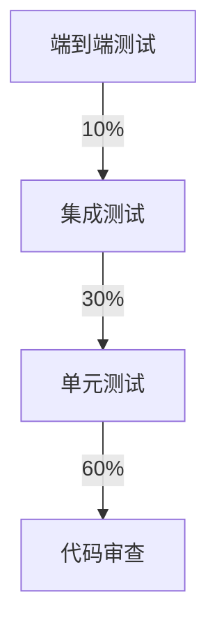

# Music Vocal Concert 测试与质量门禁

## 1. 测试策略

### 1.1 测试金字塔



### 1.2 测试类型

#### 1.2.1 单元测试
- **覆盖率目标**: >85%
- **执行时间**: <5分钟
- **工具**: pytest, Jest

#### 1.2.2 集成测试
- **覆盖率目标**: >80%
- **执行时间**: <15分钟
- **工具**: pytest, Supertest

#### 1.2.3 端到端测试
- **覆盖率目标**: >75%
- **执行时间**: <30分钟
- **工具**: Cypress, Playwright

#### 1.2.4 性能测试
- **响应时间**: <200ms
- **吞吐量**: >1000 req/s
- **工具**: JMeter, k6

### 1.3 测试环境

| 环境 | 配置 | 用途 | 访问权限 |
|------|------|------|----------|
| 开发环境 | 本地开发 | 日常开发 | 开发人员 |
| 测试环境 | 4核8G, 50G存储 | 测试验证 | 测试人员 |
| 预生产环境 | 8核16G, 100G存储 | 生产验证 | 全体人员 |
| 生产环境 | 16核32G, 200G存储 | 正式运行 | 生产用户 |

## 2. 质量门禁

### 2.1 代码质量门禁

#### 2.1.1 代码覆盖率
```bash
# 代码覆盖率检查
# Python
pytest --cov=src --cov-report=html --cov-fail-under=85

# JavaScript
npm test -- --coverage --coverage-threshold='85%'

# 覆盖率报告
# 生成HTML报告
pytest --cov=src --cov-report=html
# 生成XML报告
pytest --cov=src --cov-report=xml
```

#### 2.1.2 代码复杂度
```bash
# 代码复杂度检查
# Python
radon cc src/ --min C --exclude tests/

# JavaScript
eslint --rule 'complexity: ["error", 10]'

# 复杂度标准
# A级: 1-10 (优秀)
# B级: 11-20 (良好)
# C级: 21-30 (一般)
# D级: 31+ (需要优化)
```

#### 2.1.3 代码规范
```bash
# 代码规范检查
# Python
flake8 src/
black --check src/
isort --check-only src/

# JavaScript
eslint src/
prettier --check src/

# 规范标准
# 0个严重错误
# 0个警告
# 0个提示
```

#### 2.1.4 安全漏洞
```bash
# 安全漏洞检查
# Python
bandit -r src/
safety check -r requirements.txt

# JavaScript
npm audit
npm audit fix

# 漏洞标准
# 0个高危漏洞
# 0个中危漏洞
# 最多1个低危漏洞
```

### 2.2 构建质量门禁

#### 2.2.1 构建成功
```bash
# 构建检查
# 编译成功
npm run build
# 或
python setup.py build

# 构建标准
# 编译无错误
# 打包成功
# 镜像构建成功
```

#### 2.2.2 依赖安全
```bash
# 依赖安全检查
# Python
pip-audit --format json --output audit-report.json

# JavaScript
npm audit --audit-level=moderate

# 依赖标准
# 0个高危依赖
# 0个中危依赖
# 最多2个低危依赖
```

#### 2.2.3 代码重复
```bash
# 代码重复检查
# Python
radon mi -s src/
# JavaScript
npx jscpd src/

# 重复标准
# 重复率 < 5%
```

### 2.3 部署质量门禁

#### 2.3.1 部署验证
```bash
# 部署验证
# 健康检查
curl -f http://localhost:8000/health

# 功能检查
curl -f http://localhost:8000/api/concerts

# 部署标准
# 健康检查通过
# 功能测试通过
# 响应时间 < 200ms
```

#### 2.3.2 性能测试
```bash
# 性能测试
# 使用k6
k6 run load-test.js

# 性能测试标准
# 响应时间 < 200ms
# 错误率 < 1%
# 吞吐量 > 1000 req/s
```

#### 2.3.3 安全扫描
```bash
# 安全扫描
# 使用Trivy
trivy image music-vocal-concert:latest

# 安全扫描标准
# 0个高危漏洞
# 0个中危漏洞
# 最多1个低危漏洞
```

## 3. 测试用例

### 3.1 单元测试

#### 3.1.1 演唱会服务测试
```python
# tests/test_concert_service.py
import pytest
from unittest.mock import Mock, AsyncMock
from src.api.services.concert_service import ConcertService

@pytest.fixture
def mock_db_session():
    return AsyncMock()

@pytest.fixture
def concert_service(mock_db_session):
    service = ConcertService()
    service.db_session = mock_db_session
    return service

@pytest.mark.asyncio
async def test_get_concerts_success(concert_service, mock_db_session):
    """测试获取演唱会列表成功"""
    # 模拟数据库查询结果
    mock_result = AsyncMock()
    mock_result.scalars.return_value.all.return_value = [
        {'id': 1, 'name': '演唱会1'},
        {'id': 2, 'name': '演唱会2'}
    ]
    
    mock_db_session.execute.return_value = mock_result
    
    concerts = await concert_service.get_concerts()
    
    assert len(concerts) == 2
    assert concerts[0]['name'] == '演唱会1'
    assert concerts[1]['name'] == '演唱会2'

@pytest.mark.asyncio
async def test_get_concerts_with_filters(concert_service, mock_db_session):
    """测试带过滤条件的获取演唱会列表"""
    # 模拟数据库查询结果
    mock_result = AsyncMock()
    mock_result.scalars.return_value.all.return_value = [
        {'id': 1, 'name': '北京演唱会'}
    ]
    
    mock_db_session.execute.return_value = mock_result
    
    concerts = await concert_service.get_concerts(city='北京')
    
    assert len(concerts) == 1
    assert concerts[0]['name'] == '北京演唱会'
    # 验证查询条件
    mock_db_session.execute.assert_called_once()
```

#### 3.1.2 API接口测试
```python
# tests/test_api.py
from fastapi.testclient import TestClient
from src.api.main import app

client = TestClient(app)

def test_get_concerts():
    """测试获取演唱会列表API"""
    response = client.get("/api/concerts")
    assert response.status_code == 200
    assert response.json() == []

def test_create_concert():
    """测试创建演唱会API"""
    concert_data = {
        "name": "周杰伦演唱会",
        "artist": "周杰伦",
        "city": "北京",
        "region": "mainland",
        "date": "2026-03-15T20:00:00+08:00",
        "address": "北京工人体育馆",
        "venue": "北京工人体育馆",
        "platform": "damai"
    }
    
    response = client.post("/api/concerts", json=concert_data)
    assert response.status_code == 200
    assert response.json()["name"] == "周杰伦演唱会"

def test_get_concert_not_found():
    """测试获取不存在的演唱会"""
    response = client.get("/api/concerts/999")
    assert response.status_code == 404
```

### 3.2 集成测试

#### 3.2.1 数据库集成测试
```python
# tests/test_database.py
import pytest
from sqlalchemy import create_engine
from sqlalchemy.orm import sessionmaker
from src.api.models.concert import Concert
from src.database import Base

@pytest.fixture
def test_db():
    """测试数据库连接"""
    engine = create_engine('sqlite:///test.db')
    Base.metadata.create_all(engine)
    Session = sessionmaker(bind=engine)
    session = Session()
    
    yield session
    
    session.close()
    import os
    os.remove('test.db')

@pytest.mark.asyncio
async def test_create_concert_in_db(test_db):
    """测试在数据库中创建演唱会"""
    concert = Concert(
        name="测试演唱会",
        artist="测试歌手",
        city="北京",
        region="mainland",
        date="2026-03-15T20:00:00+08:00",
        address="测试地址",
        venue="测试场馆",
        platform="damai"
    )
    
    test_db.add(concert)
    test_db.commit()
    
    # 验证数据已保存
    saved_concert = test_db.query(Concert).filter(Concert.name == "测试演唱会").first()
    assert saved_concert is not None
    assert saved_concert.artist == "测试歌手"
```

#### 3.2.2 API集成测试
```python
# tests/test_api_integration.py
import pytest
from fastapi.testclient import TestClient
from src.api.main import app

client = TestClient(app)

@pytest.mark.asyncio
async def test_concert_lifecycle():
    """测试演唱会完整生命周期"""
    # 创建演唱会
    concert_data = {
        "name": "集成测试演唱会",
        "artist": "集成测试歌手",
        "city": "上海",
        "region": "mainland",
        "date": "2026-03-15T20:00:00+08:00",
        "address": "上海测试场馆",
        "venue": "上海测试场馆",
        "platform": "damai"
    }
    
    create_response = client.post("/api/concerts", json=concert_data)
    assert create_response.status_code == 200
    created_concert = create_response.json()
    concert_id = created_concert["id"]
    
    # 获取演唱会
    get_response = client.get(f"/api/concerts/{concert_id}")
    assert get_response.status_code == 200
    retrieved_concert = get_response.json()
    assert retrieved_concert["name"] == "集成测试演唱会"
    
    # 更新演唱会
    update_data = {"name": "更新后的演唱会"}
    update_response = client.put(f"/api/concerts/{concert_id}", json=update_data)
    assert update_response.status_code == 200
    updated_concert = update_response.json()
    assert updated_concert["name"] == "更新后的演唱会"
    
    # 删除演唱会
    delete_response = client.delete(f"/api/concerts/{concert_id}")
    assert delete_response.status_code == 200
    
    # 验证已删除
    get_response = client.get(f"/api/concerts/{concert_id}")
    assert get_response.status_code == 404
```

### 3.3 端到端测试

#### 3.3.1 前端端到端测试
```javascript
// tests/e2e/concerts.e2e.js
describe('演唱会管理', () => {
  beforeEach(() => {
    cy.visit('/concerts')
  })

  it('应该显示演唱会列表', () => {
    cy.get('[data-testid="concert-list"]').should('be.visible')
    cy.get('[data-testid="concert-card"]').should('have.length', 0)
  })

  it('应该能够搜索演唱会', () => {
    cy.get('[data-testid="search-input"]').type('周杰伦')
    cy.get('[data-testid="search-button"]').click()
    
    cy.get('[data-testid="concert-list"]').should('be.visible')
  })

  it('应该能够查看详情', () => {
    // 假设有一个演唱会
    cy.get('[data-testid="concert-card"]').first().click()
    
    cy.url().should('include', '/concerts/')
    cy.get('[data-testid="concert-detail"]').should('be.visible')
  })
})
```

#### 3.3.2 完整流程测试
```javascript
// tests/e2e/full-flow.e2e.js
describe('完整流程测试', () => {
  it('应该能够完成演唱会搜索和收藏', () => {
    // 1. 访问演唱会页面
    cy.visit('/concerts')
    
    // 2. 搜索演唱会
    cy.get('[data-testid="search-input"]').type('周杰伦')
    cy.get('[data-testid="search-button"]').click()
    
    // 3. 点击演唱会卡片
    cy.get('[data-testid="concert-card"]').first().click()
    
    // 4. 查看详情
    cy.get('[data-testid="concert-detail"]').should('be.visible')
    
    // 5. 收藏演唱会
    cy.get('[data-testid="favorite-button"]').click()
    
    // 6. 验证收藏成功
    cy.get('[data-testid="favorite-success"]').should('be.visible')
  })
})
```

### 3.4 性能测试

#### 3.4.1 负载测试
```javascript
// tests/performance/load-test.js
import http from 'k6/http'
import { check, sleep } from 'k6'

export const options = {
  stages: [
    { duration: '5m', target: 100 },  // 5分钟达到100用户
    { duration: '10m', target: 100 }, // 10分钟保持100用户
    { duration: '5m', target: 0 },    // 5分钟逐渐减少到0
  ],
  thresholds: {
    'http_req_duration': ['p(95)<200'], // 95%的请求响应时间小于200ms
    'http_req_failed': ['rate<0.01'],   // 错误率小于1%
  }
}

export default function () {
  const response = http.get('http://localhost:8000/api/concerts')
  
  check(response, {
    'status is 200': (r) => r.status === 200,
    'response time is acceptable': (r) => r.timings.duration < 200,
  })
  
  sleep(1)
}
```

#### 3.4.2 压力测试
```javascript
// tests/performance/stress-test.js
import http from 'k6/http'
import { check, sleep } from 'k6'

export const options = {
  stages: [
    { duration: '1m', target: 200 },  // 1分钟达到200用户
    { duration: '2m', target: 200 },  // 2分钟保持200用户
    { duration: '1m', target: 0 },    // 1分钟逐渐减少到0
  ],
  thresholds: {
    'http_req_duration': ['p(95)<500'], // 95%的请求响应时间小于500ms
    'http_req_failed': ['rate<0.05'],   // 错误率小于5%
  }
}

export default function () {
  const response = http.get('http://localhost:8000/api/concerts')
  
  check(response, {
    'status is 200': (r) => r.status === 200,
  })
  
  sleep(1)
}
```

## 4. 测试自动化

### 4.1 CI/CD集成

#### 4.1.1 GitHub Actions
```yaml
# .github/workflows/test.yml
name: Test and Quality

on:
  push:
    branches: [ main, develop ]
  pull_request:
    branches: [ main ]

jobs:
  test:
    runs-on: ubuntu-latest
    
    steps:
    - uses: actions/checkout@v3
    
    - name: Set up Python
      uses: actions/setup-python@v4
      with:
        python-version: '3.9'
    
    - name: Set up Node.js
      uses: actions/setup-node@v3
      with:
        node-version: '16'
    
    - name: Install dependencies
      run: |
        pip install -r requirements.txt
        npm install
    
    - name: Run unit tests
      run: |
        pytest tests/ --cov=src --cov-report=xml
        
    - name: Run integration tests
      run: |
        pytest tests/integration/ --cov=src --cov-report=xml
        
    - name: Upload coverage to Codecov
      uses: codecov/codecov-action@v3
      with:
        file: ./coverage.xml
```

#### 4.1.2 GitLab CI
```yaml
# .gitlab-ci.yml
stages:
  - test
  - build
  - deploy

unit_tests:
  stage: test
  script:
    - pip install -r requirements.txt
    - pytest tests/unit/ --cov=src --cov-report=html
    - coverage report --fail-under=85

integration_tests:
  stage: test
  script:
    - pip install -r requirements.txt
    - pytest tests/integration/ --cov=src --cov-report=html
    - coverage report --fail-under=80

e2e_tests:
  stage: test
  script:
    - npm install
    - npm run test:e2e

performance_tests:
  stage: test
  script:
    - npm install -g k6
    - k6 run tests/performance/load-test.js
    - k6 run tests/performance/stress-test.js

build:
  stage: build
  script:
    - docker build -t music-vocal-concert:$CI_COMMIT_SHA .
    - docker push music-vocal-concert:$CI_COMMIT_SHA

deploy_staging:
  stage: deploy
  script:
    - kubectl apply -f k8s/staging/
  environment:
    name: staging
    url: https://staging.music-vocal-concert.com

deploy_production:
  stage: deploy
  script:
    - kubectl apply -f k8s/production/
  environment:
    name: production
    url: https://music-vocal-concert.com
  when: manual
```

### 4.2 测试报告

#### 4.2.1 测试报告生成
```bash
# 生成测试报告
# Python测试报告
pytest tests/ --cov=src --cov-report=html --cov-report=xml --junitxml=test-results.xml

# JavaScript测试报告
npm test -- --coverage --reporters=default --reporters=jest-junit

# 合并报告
# 使用Allure生成综合报告
allure generate allure-results --clean -o allure-report
```

#### 4.2.2 质量报告
```python
# 生成质量报告
class QualityReport:
    def __init__(self):
        self.metrics = {}

    def collect_metrics(self):
        """收集质量指标"""
        # 代码覆盖率
        self.metrics['coverage'] = self._get_coverage()
        
        # 代码复杂度
        self.metrics['complexity'] = self._get_complexity()
        
        # 测试通过率
        self.metrics['test_pass_rate'] = self._get_test_pass_rate()
        
        # 安全漏洞
        self.metrics['security_vulnerabilities'] = self._get_security_vulnerabilities()

    def _get_coverage(self) -> float:
        """获取代码覆盖率"""
        # 实现覆盖率获取
        return 85.0

    def _get_complexity(self) -> dict:
        """获取代码复杂度"""
        # 实现复杂度获取
        return {'average': 5.2, 'max': 15}

    def _get_test_pass_rate(self) -> float:
        """获取测试通过率"""
        # 实现测试通过率获取
        return 97.5

    def _get_security_vulnerabilities(self) -> dict:
        """获取安全漏洞"""
        # 实现安全漏洞获取
        return {'critical': 0, 'high': 0, 'medium': 1, 'low': 2}

    def generate_report(self) -> dict:
        """生成质量报告"""
        self.collect_metrics()
        
        return {
            'timestamp': datetime.now().isoformat(),
            'metrics': self.metrics,
            'status': self._get_overall_status(),
            'recommendations': self._get_recommendations()
        }

    def _get_overall_status(self) -> str:
        """获取整体状态"""
        if self.metrics['coverage'] >= 85 and \
           self.metrics['test_pass_rate'] >= 95 and \
           self.metrics['security_vulnerabilities']['critical'] == 0:
            return 'PASS'
        else:
            return 'FAIL'

    def _get_recommendations(self) -> list:
        """获取改进建议"""
        recommendations = []
        
        if self.metrics['coverage'] < 85:
            recommendations.append('提高代码覆盖率到85%以上')
        
        if self.metrics['test_pass_rate'] < 95:
            recommendations.append('提高测试通过率到95%以上')
        
        if self.metrics['security_vulnerabilities']['critical'] > 0:
            recommendations.append('修复所有高危安全漏洞')
        
        return recommendations
```

## 5. 质量保障

### 5.1 质量门禁检查表

#### 5.1.1 代码提交前检查
```bash
# 代码提交前检查脚本
#!/bin/bash

echo "🔍 执行代码提交前检查..."

# 1. 代码格式化检查
echo "检查代码格式化..."
npm run format:check
if [ $? -ne 0 ]; then
    echo "❌ 代码格式化检查失败"
    exit 1
fi

# 2. 代码规范检查
echo "检查代码规范..."
npm run lint
if [ $? -ne 0 ]; then
    echo "❌ 代码规范检查失败"
    exit 1
fi

# 3. 单元测试检查
echo "运行单元测试..."
npm test -- --watchAll=false
if [ $? -ne 0 ]; then
    echo "❌ 单元测试检查失败"
    exit 1
fi

# 4. 代码覆盖率检查
echo "检查代码覆盖率..."
npm test -- --coverage --coverage-threshold='85%'
if [ $? -ne 0 ]; then
    echo "❌ 代码覆盖率检查失败"
    exit 1
fi

echo "✅ 所有检查通过，可以提交代码"
```

#### 5.1.2 CI/CD检查
```bash
# CI/CD检查脚本
#!/bin/bash

echo "🚀 执行CI/CD检查..."

# 1. 构建检查
echo "构建项目..."
npm run build
if [ $? -ne 0 ]; then
    echo "❌ 构建检查失败"
    exit 1
fi

# 2. 集成测试
echo "运行集成测试..."
pytest tests/integration/ --cov=src --cov-report=html
if [ $? -ne 0 ]; then
    echo "❌ 集成测试检查失败"
    exit 1
fi

# 3. 端到端测试
echo "运行端到端测试..."
npm run test:e2e
if [ $? -ne 0 ]; then
    echo "❌ 端到端测试检查失败"
    exit 1
fi

# 4. 性能测试
echo "运行性能测试..."
k6 run tests/performance/load-test.js
if [ $? -ne 0 ]; then
    echo "❌ 性能测试检查失败"
    exit 1
fi

echo "✅ 所有CI/CD检查通过"
```

### 5.2 质量监控

#### 5.2.1 实时监控
```python
# 质量监控
import logging
from datetime import datetime

class QualityMonitor:
    def __init__(self):
        self.logger = logging.getLogger('quality_monitor')

    def monitor_quality_metrics(self) -> dict:
        """监控质量指标"""
        metrics = {
            'timestamp': datetime.now().isoformat(),
            'code_coverage': self._get_coverage(),
            'test_pass_rate': self._get_test_pass_rate(),
            'security_score': self._get_security_score(),
            'performance_score': self._get_performance_score()
        }
        
        # 记录质量指标
        self.logger.info(f"Quality metrics: {metrics}")
        
        # 检查质量门禁
        if not self._passes_quality_gates(metrics):
            self.logger.error("Quality gates failed")
            # 发送告警
            self._send_quality_alert(metrics)
        
        return metrics

    def _get_coverage(self) -> float:
        """获取代码覆盖率"""
        # 实现覆盖率获取
        return 85.0

    def _get_test_pass_rate(self) -> float:
        """获取测试通过率"""
        # 实现测试通过率获取
        return 97.5

    def _get_security_score(self) -> float:
        """获取安全评分"""
        # 实现安全评分获取
        return 95.0

    def _get_performance_score(self) -> float:
        """获取性能评分"""
        # 实现性能评分获取
        return 90.0

    def _passes_quality_gates(self, metrics: dict) -> bool:
        """检查是否通过质量门禁"""
        return (
            metrics['code_coverage'] >= 85 and
            metrics['test_pass_rate'] >= 95 and
            metrics['security_score'] >= 90 and
            metrics['performance_score'] >= 80
        )

    def _send_quality_alert(self, metrics: dict):
        """发送质量告警"""
        # 实现告警发送
        pass
```

#### 5.2.2 定期报告
```python
# 定期质量报告
class QualityReporter:
    def __init__(self):
        self.monitor = QualityMonitor()

    def generate_daily_report(self) -> dict:
        """生成每日质量报告"""
        metrics = self.monitor.monitor_quality_metrics()
        
        report = {
            'date': datetime.now().date().isoformat(),
            'metrics': metrics,
            'trends': self._get_trends(),
            'issues': self._get_recent_issues(),
            'recommendations': self._get_recommendations()
        }
        
        return report

    def _get_trends(self) -> dict:
        """获取趋势分析"""
        # 实现趋势分析
        return {
            'coverage_trend': '+2%',
            'test_pass_rate_trend': '-0.5%',
            'security_score_trend': '+1%'
        }

    def _get_recent_issues(self) -> list:
        """获取最近问题"""
        # 实现问题获取
        return [
            {
                'type': 'test_failure',
                'description': '集成测试失败',
                'severity': 'high',
                'timestamp': '2026-02-08T10:30:00'
            }
        ]

    def _get_recommendations(self) -> list:
        """获取改进建议"""
        # 实现建议生成
        return [
            '提高代码覆盖率到90%',
            '优化测试执行时间',
            '加强安全扫描'
        ]
```

## 6. 附录

### 6.1 测试工具
- **pytest**: Python单元测试框架
- **Jest**: JavaScript单元测试框架
- **Cypress**: 端到端测试框架
- **k6**: 性能测试工具
- **JMeter**: 负载测试工具
- **Selenium**: Web自动化测试

### 6.2 质量工具
- **SonarQube**: 代码质量管理
- **Codecov**: 代码覆盖率报告
- **Snyk**: 安全漏洞扫描
- **Bandit**: Python安全扫描
- **ESLint**: JavaScript代码检查
- **Prettier**: 代码格式化

### 6.3 参考文档
- **ISTQB测试标准**: 国际软件测试标准
- **IEEE 829测试文档**: 测试文档标准
- **ISO/IEC 25010质量模型**: 软件产品质量模型
- **NIST网络安全框架**: 网络安全标准

**文档版本**: 1.0
**创建时间**: 2026-02-08
**最后更新**: 2026-02-08 23:57:00