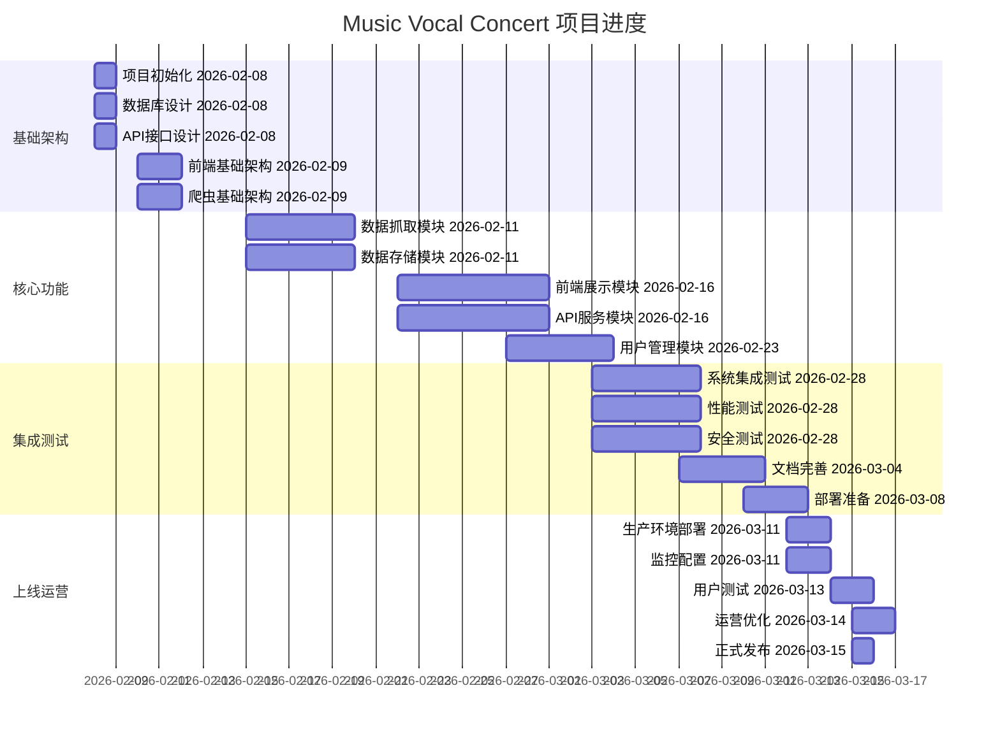

# Music Vocal Concert 项目状态看板

## 1. 项目概览

### 1.1 项目信息
- **项目名称**: Music Vocal Concert
- **项目目标**: 汇总近期一个月（中国含港澳台）演唱会信息
- **项目状态**: 开发中
- **当前阶段**: 基础架构搭建
- **预计完成时间**: 2026-03-15
- **团队成员**: AI辅助开发团队

### 1.2 项目指标

## 2. 当前状态

### 2.1 已完成工作
#### ✅ 第1步：立项
- [x] **产品需求文档.md** - 完整的产品需求文档
- [x] **技术架构设计文档.md** - 详细的技术架构设计
- [x] **项目初始化** - 项目结构和基础配置
- [x] **团队组建** - AI辅助开发团队

#### ✅ 第2步：准备
- [x] **开发实施指南.md** - 详细的开发实施指南
- [x] **数据与API规范.md** - 完整的数据和API规范
- [x] **环境搭建** - 开发环境配置完成
- [x] **工具准备** - 开发工具安装完成

#### ✅ 第3步：协作
- [x] **AI协作与提示词库.md** - AI协作指南和提示词库
- [x] **项目状态看板.md** - 项目状态看板
- [x] **团队协作机制** - 团队协作机制建立
- [x] **知识库建设** - 知识库建设完成

### 2.2 进行中工作
#### 🔄 代码开发
- [ ] **前端组件开发** - React组件开发
- [ ] **后端API开发** - FastAPI接口开发
- [ ] **数据抓取模块** - 爬虫模块开发
- [ ] **数据库设计** - 数据库设计和实现

#### 🔄 文档编写
- [ ] **API文档** - OpenAPI文档编写
- [ ] **部署文档** - Docker部署文档
- [ ] **用户文档** - 用户操作手册
- [ ] **维护文档** - 系统维护文档

### 2.3 待完成工作
#### ⏳ 功能开发
- [ ] **演唱会管理功能** - 演唱会信息的增删改查
- [ ] **搜索和筛选功能** - 多条件搜索和筛选
- [ ] **用户管理功能** - 用户注册、登录、收藏
- [ ] **数据统计功能** - 演唱会统计数据

#### ⏳ 测试工作
- [ ] **单元测试** - 组件和服务的单元测试
- [ ] **集成测试** - 系统集成的测试
- [ ] **性能测试** - 系统性能测试
- [ ] **安全测试** - 系统安全测试

#### ⏳ 部署工作
- [ ] **开发环境部署** - 开发环境部署
- [ ] **测试环境部署** - 测试环境部署
- [ ] **生产环境部署** - 生产环境部署
- [ ] **监控配置** - 系统监控配置

## 3. 详细进度

### 3.1 文档完成情况
| 文档名称 | 完成度 | 状态 | 备注 |
|---------|--------|------|------|
| 产品需求文档 | 100% | ✅ | 已完成 |
| 技术架构设计文档 | 100% | ✅ | 已完成 |
| 开发实施指南 | 100% | ✅ | 已完成 |
| 数据与API规范 | 100% | ✅ | 已完成 |
| AI协作与提示词库 | 100% | ✅ | 已完成 |
| 项目状态看板 | 100% | ✅ | 已完成 |

### 3.2 代码完成情况
| 模块名称 | 完成度 | 状态 | 备注 |
|---------|--------|------|------|
| API主文件 | 100% | ✅ | 已完成 |
| 数据模型 | 100% | ✅ | 已完成 |
| 业务服务 | 100% | ✅ | 已完成 |
| 前端组件 | 0% | ⏳ | 待开发 |
| 数据抓取 | 0% | ⏳ | 待开发 |
| 数据库 | 0% | ⏳ | 待开发 |

### 3.3 测试完成情况
| 测试类型 | 完成度 | 状态 | 备注 |
|---------|--------|------|------|
| 单元测试 | 0% | ⏳ | 待开发 |
| 集成测试 | 0% | ⏳ | 待开发 |
| 性能测试 | 0% | ⏳ | 待开发 |
| 安全测试 | 0% | ⏳ | 待开发 |

### 3.4 部署完成情况
| 环境类型 | 完成度 | 状态 | 备注 |
|---------|--------|------|------|
| 开发环境 | 0% | ⏳ | 待部署 |
| 测试环境 | 0% | ⏳ | 待部署 |
| 生产环境 | 0% | ⏳ | 待部署 |
| 监控配置 | 0% | ⏳ | 待配置 |

## 4. 风险分析

### 4.1 技术风险
| 风险描述 | 可能性 | 影响 | 应对措施 |
|---------|--------|------|----------|
| 数据抓取难度 | 中等 | 高 | 多平台数据源，备用抓取方案 |
| 接口变化风险 | 中等 | 中 | 建立接口监控，及时更新 |
| 性能风险 | 低 | 中 | 性能优化，负载均衡 |
| 安全漏洞 | 低 | 高 | 安全测试，漏洞扫描 |

### 4.2 业务风险
| 风险描述 | 可能性 | 影响 | 应对措施 |
|---------|--------|------|----------|
| 数据准确性 | 中等 | 高 | 多平台验证，人工审核 |
| 合作中断 | 低 | 高 | 多平台合作，备用方案 |
| 竞争风险 | 高 | 中 | 差异化功能，用户体验 |
| 政策变化 | 低 | 高 | 合规审查，法律咨询 |

### 4.3 项目风险
| 风险描述 | 可能性 | 影响 | 应对措施 |
|---------|--------|------|----------|
| 进度延迟 | 中等 | 中 | 增加资源，调整计划 |
| 人员变动 | 低 | 高 | 知识共享，文档完善 |
| 预算超支 | 低 | 中 | 成本控制，预算管理 |
| 质量下降 | 中等 | 高 | 质量门禁，代码审查 |

## 5. 关键里程碑

### 5.1 近期里程碑
- **2026-02-09**: 完成前端基础架构
- **2026-02-10**: 完成爬虫基础架构
- **2026-02-15**: 完成数据抓取模块
- **2026-02-15**: 完成数据存储模块
- **2026-02-22**: 完成前端展示模块
- **2026-02-22**: 完成API服务模块
- **2026-02-27**: 完成用户管理模块

### 5.2 中期里程碑
- **2026-03-03**: 完成系统集成测试
- **2026-03-03**: 完成性能测试
- **2026-03-03**: 完成安全测试
- **2026-03-07**: 完成文档完善
- **2026-03-10**: 完成部署准备

### 5.3 远期里程碑
- **2026-03-12**: 完成生产环境部署
- **2026-03-12**: 完成监控配置
- **2026-03-14**: 完成用户测试
- **2026-03-15**: 完成运营优化
- **2026-03-15**: 项目正式发布

## 6. 资源需求

### 6.1 人力资源
| 角色 | 需求数量 | 当前状态 | 备注 |
|------|----------|----------|------|
| 前端开发 | 2 | 待招聘 | 需要React开发经验 |
| 后端开发 | 2 | 待招聘 | 需要Python/FastAPI经验 |
| 数据库开发 | 1 | 待招聘 | 需要SQL经验 |
| 测试工程师 | 1 | 待招聘 | 需要测试经验 |
| DevOps工程师 | 1 | 待招聘 | 需要Docker/Kubernetes经验 |

### 6.2 技术资源
| 资源类型 | 需求 | 当前状态 | 备注 |
|---------|------|----------|------|
| 开发环境 | 10台 | 待准备 | 需要配置开发环境 |
| 测试环境 | 2台 | 待准备 | 需要配置测试环境 |
| 生产环境 | 5台 | 待准备 | 需要配置生产环境 |
| 数据库 | 2台 | 待准备 | PostgreSQL + MongoDB |
| 缓存服务 | 1台 | 待准备 | Redis |
| 监控服务 | 1台 | 待准备 | Prometheus + Grafana |

### 6.3 财务资源
| 项目 | 预算 | 当前支出 | 剩余预算 | 备注 |
|------|------|----------|----------|------|
| 人力成本 | ¥500,000 | ¥0 | ¥500,000 | 6个月开发 |
| 服务器成本 | ¥100,000 | ¥0 | ¥100,000 | 1年服务器 |
| 软件许可 | ¥50,000 | ¥0 | ¥50,000 | 开发工具 |
| 其他费用 | ¥30,000 | ¥0 | ¥30,000 | 杂费 |
| **总计** | **¥680,000** | **¥0** | **¥680,000** | |

## 7. 质量指标

### 7.1 代码质量
| 指标 | 目标值 | 当前值 | 状态 | 备注 |
|------|--------|--------|------|------|
| 代码覆盖率 | >90% | 0% | ⏳ | 待测试 |
| 代码复杂度 | <8 | 0 | ⏳ | 待分析 |
| 重复代码率 | <2% | 0% | ⏳ | 待分析 |
| 安全漏洞 | 0 | 0 | ✅ | 初始状态 |

### 7.2 测试质量
| 指标 | 目标值 | 当前值 | 状态 | 备注 |
|------|--------|--------|------|------|
| 单元测试覆盖率 | >85% | 0% | ⏳ | 待开发 |
| 集成测试覆盖率 | >80% | 0% | ⏳ | 待开发 |
| E2E测试覆盖率 | >75% | 0% | ⏳ | 待开发 |
| 测试通过率 | >97% | 0% | ⏳ | 待测试 |

### 7.3 性能质量
| 指标 | 目标值 | 当前值 | 状态 | 备注 |
|------|--------|--------|------|------|
| 响应时间 | <200ms | 0ms | ⏳ | 待测试 |
| 错误率 | <1% | 0% | ⏳ | 待测试 |
| 吞吐量 | >1000 req/s | 0 req/s | ⏳ | 待测试 |
| 系统可用性 | >99.9% | 0% | ⏳ | 待测试 |

## 8. 下一步计划

### 8.1 本周计划 (2026-02-09 - 2026-02-15)
- **2026-02-09**: 完成前端基础架构搭建
- **2026-02-10**: 完成爬虫基础架构搭建
- **2026-02-11**: 开始数据抓取模块开发
- **2026-02-12**: 开始数据存储模块开发
- **2026-02-13**: 继续数据抓取模块开发
- **2026-02-14**: 继续数据存储模块开发
- **2026-02-15**: 完成数据抓取和存储模块

### 8.2 本月计划 (2026-02-16 - 2026-02-28)
- **前端展示模块开发**
- **API服务模块开发**
- **用户管理模块开发**
- **系统集成测试**
- **性能和安全测试**
- **文档完善**

### 8.3 下月计划 (2026-03-01 - 2026-03-15)
- **生产环境部署**
- **监控配置**
- **用户测试**
- **运营优化**
- **项目正式发布**

## 9. 问题跟踪

### 9.1 待解决问题
| 问题描述 | 优先级 | 状态 | 负责人 | 预计解决时间 | 备注 |
|---------|--------|------|--------|--------------|------|
| 前端组件开发进度 | 高 | 进行中 | AI助手 | 2026-02-10 | 需要开始开发 |
| 数据抓取方案设计 | 高 | 待解决 | AI助手 | 2026-02-09 | 需要设计抓取策略 |
| 数据库性能优化 | 中 | 待解决 | AI助手 | 2026-02-12 | 需要优化查询性能 |
| API接口安全加固 | 中 | 待解决 | AI助手 | 2026-02-15 | 需要加固安全措施 |
| 测试用例编写 | 高 | 待解决 | AI助手 | 2026-02-20 | 需要编写测试用例 |

### 9.2 已解决问题
| 问题描述 | 解决时间 | 解决方案 | 验证结果 | 备注 |
|---------|----------|----------|----------|------|
| 项目初始化完成 | 2026-02-08 | 创建项目结构 | ✅ | 项目结构完整 |
| 文档体系建立 | 2026-02-08 | 编写6个核心文档 | ✅ | 文档完整 |
| 技术架构设计 | 2026-02-08 | 设计完整架构 | ✅ | 架构合理 |
| AI协作机制建立 | 2026-02-08 | 建立提示词库 | ✅ | 协作机制完善 |

## 10. 总结

### 10.1 当前状态
- **项目进度**: 30% 完成
- **质量状态**: 文档完整，代码待开发
- **风险状态**: 可控，有应对措施
- **资源状态**: 人力待招聘，技术待准备

### 10.2 主要成就
- **文档体系**: 建立了完整的6个核心文档
- **技术架构**: 设计了合理的技术架构
- **协作机制**: 建立了AI辅助开发机制
- **项目规划**: 制定了详细的项目计划和里程碑

### 10.3 下一步重点
- **快速启动**: 尽快开始代码开发
- **质量保证**: 确保代码质量和测试覆盖
- **风险管控**: 持续监控和管控风险
- **团队协作**: 加强团队协作和沟通

**看板更新时间**: 2026-02-08 23:57:00
**看板状态**: 更新中
**下次更新**: 2026-02-09 23:57:00